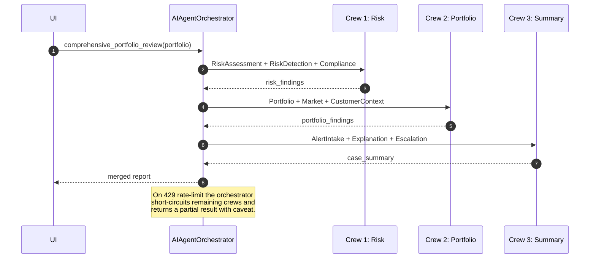

# FinGuard — Agent Design Documentation

Per-agent design doc following the Presentation Guideline §3 and the Group
Report §4 templates. Every agent inherits `FinancialBaseAgent`
(`backend/agents/base_agent.py`) which supplies the Groq client, RAG
retrieval, exponential-backoff retry, and the prompt-injection guardrail.

## 0. Shared properties

| Concern | Implementation |
|---|---|
| Reasoning pattern | Single-shot LLM reasoning + deterministic rules (hybrid) |
| Memory | Short-term conversational history (in-process, cleared between crews) |
| Long-term memory | ChromaDB RAG per-domain collection |
| Guardrail | `agents/guardrails.sanitize()` before every LLM call |
| Fallback | 3-attempt exponential backoff (2s / 4s / 8s) on 429; crew skip on persistent rate limit |
| Communication | Orchestrator (`crew_orchestrator.AIAgentOrchestrator`) sequences 3 sub-crews; agents exchange data via crew task outputs and the SQL layer |
| Telemetry | `record_llm_call(agent)` → `finguard_llm_calls_total` on `/api/metrics` |

---

## 1. AlertIntakeAgent
* **File**: `backend/agents/alert_intake_agent.py`
* **Purpose**: First touch — ingest and categorise raw financial alerts.
* **Input**: `alert_payload = {type, severity, customer_id, symbol, details}`
* **Output**: `{category, urgency, ml_risk_score, enriched_context}`
* **Planning / reasoning**: Rule-driven classification first; LLM narrative only if the category is ambiguous.
* **Memory**: short-term only (intake is stateless across alerts).
* **Tools**: `TransactionRiskEngine.score()` for pre-scoring.
* **Upstream**: REST `POST /api/alerts`. **Downstream**: RiskAssessmentAgent, EscalationCaseSummaryAgent.
* **Prompt pattern**: system prompt = "alert intake specialist"; user = enriched payload.
* **Fallback**: if RiskEngine unavailable → LLM-only categorisation with a visible caveat flag.

## 2. CustomerContextAgent
* **File**: `backend/agents/customer_context_agent.py`
* **Purpose**: Build/maintain a customer 360 — KYC profile, behaviour baseline.
* **Input**: `customer_id`. **Output**: `{profile, avg_txn, segments, risk_appetite}`.
* **Reasoning**: DB lookup + RAG from `customer_context` domain.
* **Memory**: short-term; long-term in SQL (Customer table).
* **Tools**: SQLAlchemy queries + `get_rag_context()`.
* **Up/down**: serves RiskAssessmentAgent and PortfolioAnalysisAgent with context.

## 3. RiskAssessmentAgent
* **File**: `backend/agents/risk_assessment_agent.py`
* **Purpose**: Comprehensive risk verdict for a transaction or alert.
* **Input**: `txn dict`. **Output**: `score_transaction_risk()` → full result from `TransactionRiskEngine`.
* **Reasoning**: Three-tier (Rules → ML → LLM). LLM only when `40 ≤ score ≤ 60`.
* **Memory**: none persisted; every call is independent.
* **Tools**: `TransactionRiskEngine`, compliance look-ups.
* **Prompt pattern**: deep-dive narrative with explicit JSON schema for the answer.
* **Fallback**: hard-block from rules overrides ML for sanctioned country regardless of LLM opinion.

## 4. RiskDetectionAgent
* **File**: `backend/agents/risk_detection_agent.py`
* **Purpose**: Pattern-based fraud detection (velocity, structuring, mule patterns).
* **Input**: list of recent txns. **Output**: `{fraud_patterns, market_risk, concentration_risk}`.
* **Tools**: `detect_fraud_patterns`, `assess_market_risk`, `evaluate_concentration` (CrewAI tools).
* **Reasoning**: rule-heavy; LLM used for the human-readable narrative.

## 5. PortfolioAnalysisAgent
* **File**: `backend/agents/portfolio_analysis_agent.py`
* **Purpose**: Portfolio construction review — allocation, diversification, rebalance ideas.
* **Input**: `portfolio_id`. **Output**: `{allocation_analysis, diversification_score, rebalance_plan}`.
* **Tools**: `analyze_allocation`, `calculate_diversification`, `recommend_rebalance`.
* **Memory**: none; pulls fresh snapshot from SQL.

## 6. MarketIntelligenceAgent
* **File**: `backend/agents/market_intelligence_agent.py`
* **Purpose**: Sentiment + macro trend synthesis per symbol / sector.
* **Tools**: `analyze_sentiment`, `identify_trends`, `generate_recommendations`.
* **Reasoning**: LLM-led because sentiment narrative is the deliverable.

## 7. ComplianceAgent
* **File**: `backend/agents/compliance_agent.py`
* **Purpose**: Rules enforcement — PDT, wash-sale, tax, AML signals.
* **Tools**: `check_pdt_violations`, `identify_wash_sales`, `generate_tax_report`.
* **Prompt pattern**: deterministic checklists; LLM only produces the summary narrative.

## 8. ExplanationAgent
* **File**: `backend/agents/explanation_agent.py`
* **Purpose**: Generate stakeholder-tailored explanations.
* **Input**: `alert | recommendation | score + audience`. **Output**: plain-text rationale.
* **Reasoning**: audience-conditioned prompt — customer / advisor / compliance / executive.
* **Memory**: none; single-shot.
* **Fallback**: if LLM unavailable, a template-based explanation is rendered from `rule_details`.

## 9. EscalationCaseSummaryAgent
* **File**: `backend/agents/escalation_case_summary_agent.py`
* **Purpose**: Case summary + escalation routing.
* **Input**: case state + all prior agent outputs. **Output**: case summary, SAR draft, escalation target role.
* **Reasoning**: hard rules decide routing; LLM drafts the narrative.
* **Downstream**: SAR export endpoint (`/api/sar/…`).

---

## Coordination protocol

## Inter-agent communication protocol

| Channel | Carries | Format |
|---|---|---|
| CrewAI task output | structured JSON agent findings | Pydantic / dict |
| SQL (Case, CaseEvent) | persisted state, audit | SQLAlchemy models |
| `/api/metrics` | telemetry (call count, blocks) | Prometheus text |
| audit log | decisions | hash-chained JSON |

## Fallback strategies (consolidated)

| Failure mode | Handler | User-visible result |
|---|---|---|
| Groq 429 | `base_agent._retry` → crew skip | "Partial analysis — rate limited" |
| Groq 401 | raised as config error | "LLM auth failed — contact admin" |
| Guardrail block | `PromptInjectionDetected` | "Input rejected: prompt-injection" |
| ML model missing | `MLScorer.available = False` | Rules-only score with `method="rules"` |
| ChromaDB empty | `_get_rag_context` returns `""` | LLM runs without RAG grounding |
| Audit write fails | exception captured, request still served | Alert raised via `/api/metrics` |
