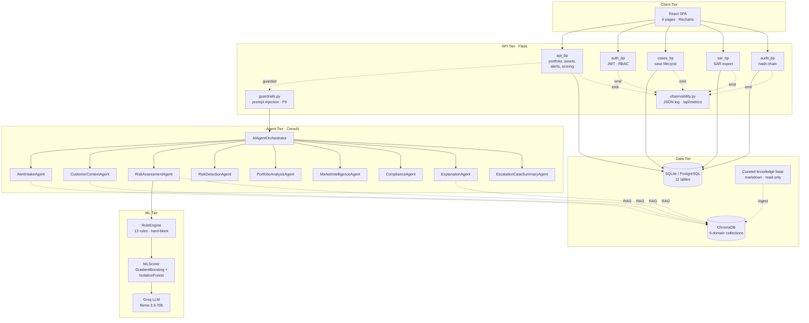
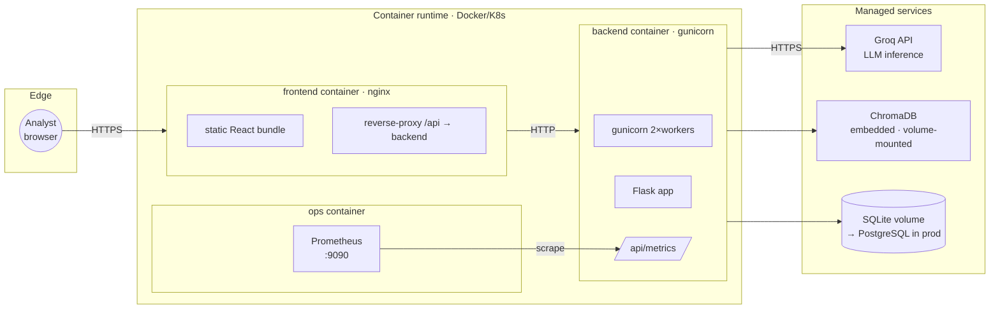
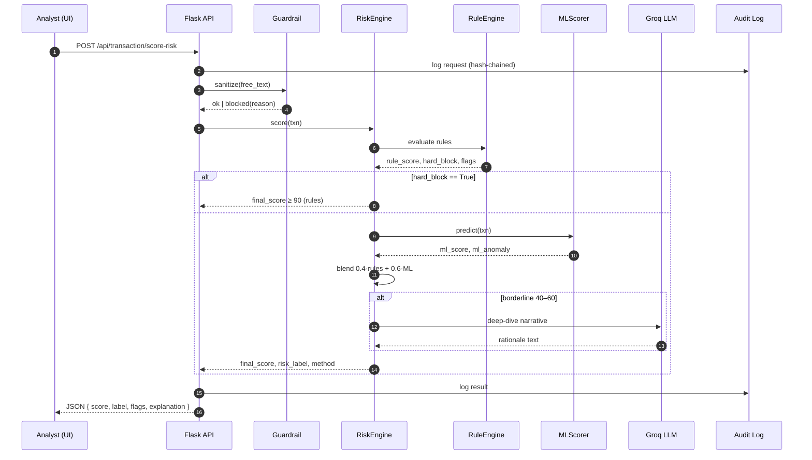

# FinGuard — System Architecture

Satisfies Briefing p.12 (System Architecture Document) and Presentation
Guideline §2.

## 1. Logical Architecture

### Style justification

* **Layered architecture** (Client → API → Agents → ML → Data): each tier has
  one reason to change, which keeps agent prompt changes isolated from API
  contracts.
* **Hybrid rule+ML+LLM scoring**: rules are fast, deterministic and auditable;
  ML adds fuzzy coverage for unseen combinations; LLM handles the long-tail
  borderline narrative. This is the **Ensemble with Fallback** pattern — best
  of all three without over-trusting any one.
* **RAG over 9 domain-specific ChromaDB collections**: per-agent retrieval
  filter prevents cross-domain hallucination (a compliance question never
  pulls from the market-intelligence collection).
* **Append-only audit chain**: mandatory for FinTech; decouples governance
  from application logic.

## 2. Physical Architecture (deployment)

### Infrastructure details

| Component | Image / Tech | Port | Persistence |
|---|---|---|---|
| Frontend | `finguard/frontend:latest` (nginx:1.27-alpine) | 80 → 8080 | — |
| Backend | `finguard/backend:latest` (python:3.11-slim + gunicorn) | 5001 | `backend-data` volume |
| Prometheus | `prom/prometheus:v2.55.0` | 9090 | optional |
| ChromaDB | Embedded in backend | — | `backend-data/chroma` |
| DB | SQLite (dev) / Postgres (prod) | — | `backend-data/finguard.db` |

### Deployment strategy

1. **Build**: `docker build -f backend/Dockerfile .` and
   `docker build -f frontend/Dockerfile .`
2. **Scan**: Trivy HIGH/CRITICAL fail-safe (CI job `docker-build-scan`).
3. **Ship**: push to registry with immutable tag = git SHA.
4. **Release**: `docker compose up -d` for single-host; Helm chart for K8s
   (future).
5. **Promote**: staging env approves manually → production (CI job
   `deploy-staging` placeholder).

## 3. Data Flow — risk scoring of a single transaction

## 4. Tech Stack

| Layer | Tech | Version | Why |
|---|---|---|---|
| UI | React + TailwindCSS + Recharts | 18.2 | SPA, rich charting, ubiquitous |
| API | Flask + Gunicorn | 3.0 | Minimal, stable, extension-rich |
| ORM | SQLAlchemy | 2.0 | Type-safe, migration-friendly |
| Agent framework | CrewAI | 0.108 | Native multi-agent primitives |
| LLM | Groq (`llama-3.3-70b`) | — | Low-latency, OpenAI-compatible |
| Vector store | ChromaDB | 0.6 | Embeddable, persistent, no server |
| ML | scikit-learn (GradientBoosting + IsolationForest) | 1.8 | CPU-only, interpretable |
| Auth | PyJWT | 2.8 | Standard JWT |
| Container | Docker + Compose | 24 / 2 | Reproducible builds |
| CI | GitHub Actions | — | Already in the team's workflow |
| Metrics | Prometheus text format (`/api/metrics`) | 0.0.4 | Scrape-friendly, no SDK needed |
| Image scan | Trivy | 0.50 | Free, SARIF → GitHub code-scanning |
| SAST | Bandit | — | Python-native |
| Dep CVE | pip-audit | — | PyPI-backed advisory database |
